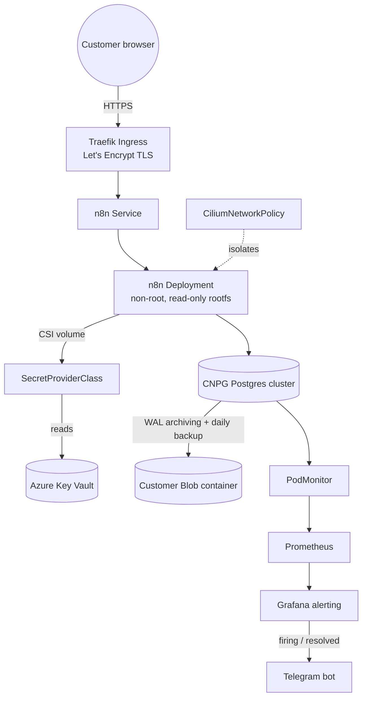

# ☁️ Cloudlab

[](https://www.terraform.io/)
[](https://kubernetes.io/)
[](https://fluxcd.io/)

A cloud platform where every customer gets their own isolated app, database, and backups — running on Azure Kubernetes, provisioned by Terraform, and kept in sync automatically by Flux. Adding a new customer is a one-line change.

> **Note on cost:** this cluster does not run 24/7. It's a demo/portfolio environment — spun up with `terraform apply` to demonstrate or test, then torn down with `terraform destroy` to avoid paying for idle AKS nodes and Azure resources around the clock.

**Jump to:** [Philosophy](#philosophy) · [Architecture](#-architecture) · [Stack](#-stack) · [How to Run](#-how-to-run) · [Repository Structure](#-repository-structure) · [Customer Model](#-customer-model) · [Adding a New Customer](#-adding-a-new-customer) · [Infrastructure & Data](#-infrastructure--data) · [Notable Decisions](#-notable-decisions) · [Engineering Challenges](#-engineering-challenges) · [Connect](#-connect)

---

## Philosophy

**Two layers, two tools, one boundary.**

- **Terraform builds the cloud infrastructure** — the Kubernetes cluster, the secrets vault, storage, and every customer's cloud resources.
- **Flux keeps the cluster in sync with this repo** — it applies app configs, network rules, and monitoring automatically. Nothing gets deployed by hand.
- **Onboarding a customer is one line in a list.** Terraform creates their cloud resources and all their Kubernetes config files, and updates the file that tells Flux about them — no one writes that config by hand.
- **Staging and production never touch each other** — separate clusters, separate vaults, separate storage. A mistake in one can't reach the other.
- **Every customer gets the identical setup** — their own database, their own app, walled off from other customers on the network, backed up continuously, and locked down with Kubernetes' strictest security profile from day one.

---

## 🧭 Architecture

**Per-customer runtime** — every tenant is the same shape: Traefik in front, n8n in the middle, a dedicated Postgres cluster behind it, secrets from Key Vault, backups to Blob, metrics to Prometheus.



---

## 🧰 Stack

| Tool | Purpose |
|------|---------|
| Terraform | Builds the cloud infrastructure and generates each customer's Kubernetes config |
| AKS | Azure's managed Kubernetes — runs the cluster; system components and customer apps use separate node pools so one can't starve the other |
| Flux | Watches this Git repo and automatically applies changes to the cluster |
| Kustomize | Reuses the same Kubernetes config across staging and production with small per-environment tweaks |
| Cilium | Handles pod networking and the firewall rules between customers |
| Traefik | Routes incoming web traffic to the right customer's app |
| cert-manager | Automatically issues and renews HTTPS certificates |
| Azure Key Vault + CSI driver | Stores passwords and tokens outside of Git, mounted into pods securely at startup |
| CloudNative-PG | Runs and manages a dedicated Postgres database for each customer |
| Barman Cloud plugin | Continuously backs up each customer's database to cloud storage |
| n8n | The workflow-automation app each customer actually uses |
| kube-prometheus-stack | Collects cluster metrics (Prometheus) and displays them (Grafana) |
| Grafana alerting | Sends an alert to Telegram when something breaks (Alertmanager is disabled — Grafana handles this directly) |

---

## 🚀 How to Run

Prerequisites: `az login`, Terraform >= 1.0, `kubectl`, Flux CLI (optional, for manual reconciles).

```bash
# 1. Register the Flux extension provider (one-time per subscription)
az provider register --namespace Microsoft.KubernetesConfiguration

# 2. Provision the environment — creates the AKS cluster, Key Vault, storage account,
#    the Flux extension, and apps/staging/<customer>/ manifests for everyone in customers.tf
cd staging
terraform init
terraform apply

# 3. Get cluster credentials
az aks get-credentials --resource-group rg-cloudlab-aks --name cloudlab-staging

# 4. Point DNS at the Traefik LoadBalancer IP
kubectl get svc -n traefik traefik -o jsonpath='{.status.loadBalancer.ingress[0].ip}'
# create a wildcard A record: *.cloudlab.<your-domain> -> that IP

# 5. Commit and push the manifests Terraform just generated
git add apps/staging && git commit -m "onboard customers" && git push

# 6. Force an immediate sync instead of waiting on the 5-minute interval
flux reconcile source git cloudlab-staging
```

If the cluster was recreated, `terraform apply` prints a reminder (`gitops_identity_reminder` output) to update the AKS Key Vault identity in `monitoring/controllers/<env>/kube-prometheus-stack/kustomization.yaml`.

Tear down with `terraform destroy` from the same directory — the normal way to stop paying for it between demos, see the cost note above.

---

## 📁 Repository Structure

<details>
<summary>Click to view the full layout ▶</summary>

```
Cloudlab/
├── staging/                        ← Terraform root module — staging AKS cluster
│   ├── main.tf                     ← AKS cluster, Flux extension, Key Vault
│   ├── customers.tf                ← customer list — add a name here to onboard
│   ├── backups.tf                  ← shared storage account for CNPG backups
│   └── outputs.tf
├── production/                     ← Terraform root module — production AKS cluster (mirrors staging)
├── modules/
│   └── customer-onboarding/        ← the onboarding module
│       ├── main.tf                 ← Azure Blob container + SAS token per customer
│       ├── secrets.tf              ← Key Vault secrets (db creds, blob SAS, Telegram)
│       └── gitops.tf               ← generates all 13 K8s manifests via local_file
├── apps/
│   ├── staging/<customer>/         ← generated per-customer manifests (namespace → ingress)
│   └── production/<customer>/
├── infrastructure/
│   ├── controllers/{base,staging,production}/   ← Traefik, cert-manager, CNPG operator (Helm via Flux)
│   ├── configs/{base,staging,production}/       ← cert-manager ClusterIssuers
│   └── cnpg-plugin/{base,staging,production}/   ← Barman Cloud plugin for CNPG
└── monitoring/
    ├── controllers/{base,staging,production}/   ← kube-prometheus-stack Helm release
    └── configs/{base,staging,production}/       ← Grafana alert rules, contact points, notification policies
```

</details>

Flux applies these in order, each one waiting for the last: controllers → configs → database backup plugin → customer apps → monitoring. Apps wait for the backup plugin because every customer's database depends on it being ready first.

---

## 👥 Customer Model

Adding a name to `customers.tf` produces, via `modules/customer-onboarding`:

- **Cloud resources** — a private storage container for backups, a time-limited access token, and secrets in Key Vault for the app's login and Telegram alerts.
- **Everything needed to run their app** (`apps/<env>/<customer>/`) — a namespace, a database with automatic backups, the app itself, a public URL with HTTPS, network rules that wall them off from other customers, and a metrics hook.

<details>
<summary>Exact list of what gets generated ▶</summary>

- Namespace, locked down with Kubernetes' strictest security profile (`restricted`)
- `SecretProviderClass` pulling all 6 secrets from Key Vault
- CNPG `Cluster` + `ObjectStore` + `ScheduledBackup` (daily, 14-day retention)
- n8n `Deployment` (non-root, read-only filesystem, no extra permissions) + `Service` + persistent volume
- Traefik `Ingress` with automatic HTTPS at `<customer>.cloudlab.rahatahsan.com`
- `CiliumNetworkPolicy` — only Traefik can reach the app in, only the customer's own database can be reached out
- `PodMonitor` for database metrics

</details>

Terraform writes each customer's directory itself, then regenerates the environment's `kustomization.yaml` listing every customer — so the file that wires everything into Flux is never hand-edited.

Demo tenants (both environments, fictional): `luffy`, `zoro`, `nami`.

---

## ➕ Adding a New Customer

This is the whole workflow — no manifests to write by hand, no `kubectl apply`.

```bash
# 1. Add the customer name to the set
vim staging/customers.tf   # add "new-customer" to the `customers` set

# 2. Apply — creates the Azure resources and generates apps/staging/new-customer/
cd staging
terraform apply

# 3. Push the generated manifests
git add apps/staging/new-customer apps/staging/kustomization.yaml
git commit -m "onboard new-customer"
git push

# 4. Sync now instead of waiting up to 5 minutes for Flux's poll interval
flux reconcile source git cloudlab-staging
```

Once Flux reconciles the namespace, database, and n8n deployment (usually under two minutes), the customer is live at `https://new-customer.cloudlab.rahatahsan.com`. Repeat against `production/customers.tf` to promote.

---

## 📊 Infrastructure & Data

- **Compute** — critical system components and customer apps run on separate machine pools, so a busy customer can't starve the cluster's core services. Upgrades happen automatically, but only during a weekly maintenance window.
- **Secrets** — passwords and tokens live in Azure Key Vault, never in this repo, even encrypted. Kubernetes pulls them in securely at startup.
- **Backups** — every customer's database streams a continuous backup to its own private cloud storage, with daily snapshots kept for two weeks. One customer's backups can't affect another's.
- **Monitoring** — every environment has its own dashboard and alerting. If a customer's app, database, or a cluster node has a problem, an alert reaches Telegram within minutes.

---

## 🔥 Notable Decisions

- **Terraform generates the Kubernetes config files instead of templating them** — every customer's setup is plain, readable YAML committed to Git, not hidden behind a template someone has to mentally expand.
- **No shared config between environments** — staging and production customers are fully self-contained, so they can differ in size without fighting a shared template.
- **Each customer runs a single database instance, not three** — reduced from the usual high-availability default because of an Azure vCPU limit on this demo account, not a design choice. Production capacity just needs a quota increase to restore it.
- **One customer's app cannot reach another customer's database** — network rules are scoped per customer even though everyone shares the same cluster.
- **Some secrets are set once and left alone** — access tokens and chat IDs are marked "don't touch," so a routine `terraform apply` doesn't quietly rotate something meant to stay stable.

---

## 🔧 Engineering Challenges

Real problems I hit while building and running this — not tutorial steps. Eight of them, click each to expand.

<details>
<summary><b>1. A second Git repo hid all the config from Flux</b></summary>

**Issue:** Accidentally initialized a second git repo inside the `gitops/` subdirectory, making all GitOps manifests invisible to the outer repo. Flux couldn't find any paths after push.
**Solution:** Removed the nested `.git` folder, moved all manifests to repo root, updated `gitops_repo_path` in Terraform to match.

</details>

<details>
<summary><b>2. Tailscale's DNS silently broke Terraform</b></summary>

**Issue:** `terraform init` failed to reach `registry.terraform.io` due to a misbehaving IPv6 DNS server injected by Tailscale.
**Solution:** Overrode `/etc/resolv.conf` with Google DNS (`8.8.8.8`) to force IPv4 resolution.

</details>

<details>
<summary><b>3. Wrong Kubernetes version required a paid support tier</b></summary>

**Issue:** AKS rejected version `1.32.1` as it requires the Premium/LTS support plan in Canada Central.
**Solution:** Queried supported versions with `az aks get-versions --location canadacentral` and pinned to `1.34.8`.

</details>

<details>
<summary><b>4. A 231MB binary got committed to Git</b></summary>

**Issue:** Running `terraform init` before creating `.gitignore` committed the Azure provider binary. GitHub rejected the push.
**Solution:** Used `git filter-branch` to purge the binary from git history. Added `.gitignore` with `**/.terraform/` before any future `terraform init`.

</details>

<details>
<summary><b>5. Flux silently refused a cross-namespace reference</b></summary>

**Issue:** The database backup plugin's Helm release was defined in the `cnpg-system` namespace but pointed at a chart repository registered in `flux-system`. Flux blocks that kind of cross-namespace reference by default.
**Solution:** Moved the release's metadata into `flux-system` (its target namespace stayed `cnpg-system`). Also had to manually delete the stale object, since Kubernetes won't move an existing resource to a new namespace in-place.

</details>

<details>
<summary><b>6. An invalid version string made a Helm release silently do nothing</b></summary>

**Issue:** Used `version: "0.x"` for the backup plugin's Helm chart, which isn't valid semver. Flux never processed it — no error, just nothing happening.
**Solution:** Queried available versions with `helm search repo cnpg/plugin-barman-cloud --versions` and pinned to `0.7.0`.

</details>

<details>
<summary><b>7. Every customer got a 404 with the wrong TLS certificate</b></summary>

**Issue:** The Traefik chart version in use creates an ingress class named `traefik-traefik` by default, but every ingress manifest referenced `traefik`. Traefik ignored all of them, served its own self-signed certificate, and returned 404 everywhere.
**Detection:** `kubectl get ingressclass` showed the mismatch; `openssl s_client` confirmed Traefik was serving its default cert instead of the real one.
**Solution:** Upgraded Traefik and explicitly set the ingress class name in its config to match the manifests.

</details>

<details>
<summary><b>8. Ran out of disk slots for a 4th node</b></summary>

**Issue:** Each node type in use allows a maximum of 4 attached disks. With 3 customers × 3 database replicas + 3 app volumes = 12 volumes spread across 3 nodes, every disk slot was full — Prometheus couldn't get one for itself.
**Attempted fix:** Adding a 4th node failed — not enough spare CPU quota left in the region.
**Solution:** Dropped each customer to a single database instance for this demo environment, and patched the already-running databases directly since Kubernetes won't scale them down just by re-applying the config:
```bash
kubectl patch cluster luffy-db -n luffy --type merge -p '{"spec":{"instances":1}}'
```

</details>

---

## 🌐 Connect

[LinkedIn](https://www.linkedin.com/in/rahatahsan/) &nbsp;•&nbsp; [Twitter/X](https://x.com/RahatAhsan20) &nbsp;•&nbsp; [GitHub (Main Profile)](https://github.com/AhsanRahat12) &nbsp;•&nbsp; [Medium](https://medium.com/@s.rahatahsan)
