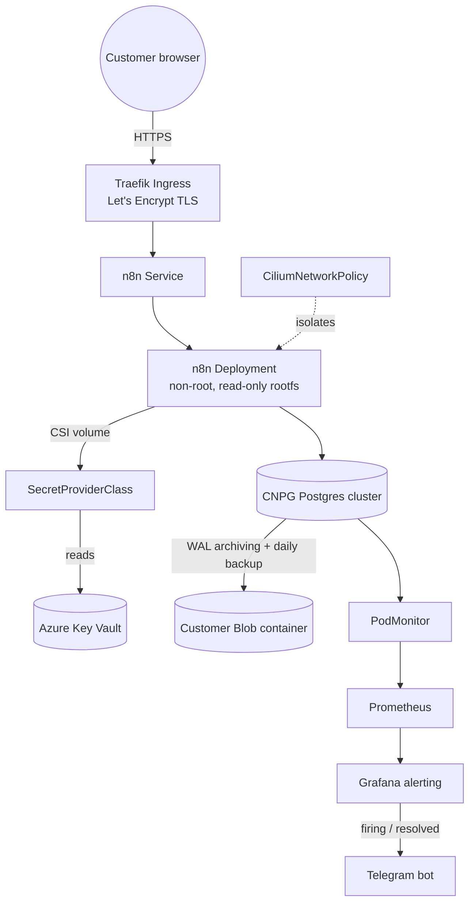

# ☁️ Cloudlab

[](https://www.terraform.io/)
[](https://kubernetes.io/)
[](https://fluxcd.io/)

Multi-tenant SaaS platform on Azure AKS — Terraform provisions the cloud infrastructure and generates the GitOps manifests, Flux syncs them to the cluster. Onboarding a new customer is a one-line change to a Terraform list.

> **Note on cost:** this cluster does not run 24/7. It's a demo/portfolio environment — spun up with `terraform apply` to demonstrate or test, then torn down with `terraform destroy` to avoid paying for idle AKS nodes and Azure resources around the clock.

---

## Philosophy

Two layers, two tools, one boundary. Terraform owns everything with state: the AKS cluster, node pools, Key Vault, storage accounts, secrets, per-customer Azure resources. Flux owns everything that's just declarative YAML: workloads, ingress, network policy, monitoring. Terraform writes the YAML into this repo as a side effect of provisioning a customer — it never talks to the Kubernetes API directly.

Customer onboarding is a single Terraform module (`modules/customer-onboarding`) invoked once per name in a `customers` set. Adding a customer means adding a string and running `terraform apply` — Terraform creates the Azure Blob container, Key Vault secrets, and 13 Kubernetes manifests, then commits the last piece itself: the kustomization that lists every customer directory.

Environments are fully isolated, not overlays of a shared base. `staging` and `production` are separate Terraform root modules, separate AKS clusters, separate Key Vaults, separate storage accounts — deliberately, so a mistake in staging can't touch production state.

Every customer is a Postgres database (CloudNative-PG) plus an n8n instance, network-isolated with Cilium, backed up continuously to Azure Blob via the Barman Cloud plugin, and deployed under Pod Security Standards `restricted` from day one.

---

## 🗺️ Architecture

**Per-customer runtime** — every tenant is the same shape: Traefik in front, n8n in the middle, a dedicated Postgres cluster behind it, secrets from Key Vault, backups to Blob, metrics to Prometheus.



---

## 🧰 Stack

| Tool | Purpose |
|------|---------|
| Terraform | Provisions AKS, Key Vault, storage, and per-customer Azure resources; generates GitOps manifests |
| AKS | Managed Kubernetes — system pool tainted `CriticalAddonsOnly`, user pool for workloads |
| Flux | GitOps controller — deployed as an AKS extension, syncs cluster state from this repo |
| Kustomize | Environment-specific configuration and overlays |
| Cilium | CNI + network policy — per-customer network isolation |
| Traefik | Ingress controller |
| cert-manager | Automated TLS via Let's Encrypt |
| Azure Key Vault + CSI driver | Secret storage — synced into pods via `SecretProviderClass`, no secrets in Git |
| CloudNative-PG | PostgreSQL operator — one dedicated cluster per customer |
| Barman Cloud plugin | Continuous WAL archiving and scheduled backups to Azure Blob Storage |
| n8n | Workflow automation app — the actual product each customer runs |
| kube-prometheus-stack | Prometheus + Grafana |
| Grafana alerting | Alertmanager is disabled — Grafana's built-in alerting handles rules, contact points, and routing to Telegram |

---

## 🚀 How to Run

Prerequisites: `az login`, Terraform >= 1.0, `kubectl`, Flux CLI (optional, for manual reconciles).

```bash
# 1. Register the Flux extension provider (one-time per subscription)
az provider register --namespace Microsoft.KubernetesConfiguration

# 2. Provision the environment — creates the AKS cluster, Key Vault, storage account,
#    the Flux extension, and apps/staging/<customer>/ manifests for everyone in customers.tf
cd staging
terraform init
terraform apply

# 3. Get cluster credentials
az aks get-credentials --resource-group rg-cloudlab-aks --name cloudlab-staging

# 4. Point DNS at the Traefik LoadBalancer IP
kubectl get svc -n traefik traefik -o jsonpath='{.status.loadBalancer.ingress[0].ip}'
# create a wildcard A record: *.cloudlab.<your-domain> -> that IP

# 5. Commit and push the manifests Terraform just generated
git add apps/staging && git commit -m "onboard customers" && git push

# 6. Force an immediate sync instead of waiting on the 5-minute interval
flux reconcile source git cloudlab-staging
```

If the cluster was recreated, `terraform apply` prints a reminder (`gitops_identity_reminder` output) to update the AKS Key Vault identity in `monitoring/controllers/<env>/kube-prometheus-stack/kustomization.yaml`.

Tear down with `terraform destroy` from the same directory — the normal way to stop paying for it between demos, see the cost note above.

---

## 📁 Repository Structure

```
Cloudlab/
├── staging/                        ← Terraform root module — staging AKS cluster
│   ├── main.tf                     ← AKS cluster, Flux extension, Key Vault
│   ├── customers.tf                ← customer list — add a name here to onboard
│   ├── backups.tf                  ← shared storage account for CNPG backups
│   └── outputs.tf
├── production/                     ← Terraform root module — production AKS cluster (mirrors staging)
├── modules/
│   └── customer-onboarding/        ← the onboarding module
│       ├── main.tf                 ← Azure Blob container + SAS token per customer
│       ├── secrets.tf              ← Key Vault secrets (db creds, blob SAS, Telegram)
│       └── gitops.tf               ← generates all 13 K8s manifests via local_file
├── apps/
│   ├── staging/<customer>/         ← generated per-customer manifests (namespace → ingress)
│   └── production/<customer>/
├── infrastructure/
│   ├── controllers/{base,staging,production}/   ← Traefik, cert-manager, CNPG operator (Helm via Flux)
│   ├── configs/{base,staging,production}/       ← cert-manager ClusterIssuers
│   └── cnpg-plugin/{base,staging,production}/   ← Barman Cloud plugin for CNPG
└── monitoring/
    ├── controllers/{base,staging,production}/   ← kube-prometheus-stack Helm release
    └── configs/{base,staging,production}/       ← Grafana alert rules, contact points, notification policies
```

Flux watches five dependency-chained Kustomizations per environment: `infra-controllers` → `infra-configs` → `cnpg-plugin` → `apps` → `monitoring-controllers` → `monitoring-configs`. Apps wait on the CNPG plugin because every customer's database backup config depends on it being ready.

---

## 👥 Customer Onboarding

Each entry in `customers.tf`'s `customers` set produces, via `modules/customer-onboarding`:

**Azure resources:** a private Blob container for backups, a 2-year SAS token, and 6 Key Vault secrets (db user/password, blob SAS, Telegram bot token/chat ID).

**Kubernetes manifests** (`apps/<env>/<customer>/`): namespace (PSS `restricted`), `SecretProviderClass` pulling all 6 secrets from Key Vault, CNPG `Cluster` + `ObjectStore` + `ScheduledBackup` (daily, 14-day retention), n8n `Deployment` (non-root, read-only rootfs, all capabilities dropped) + `Service` + PVC, Traefik `Ingress` with automatic TLS at `<customer>.cloudlab.rahatahsan.com`, a `CiliumNetworkPolicy` restricting ingress to Traefik and egress to the customer's own database plus DNS and HTTPS, and a `PodMonitor` for CNPG metrics.

Terraform writes each customer's directory itself, then regenerates the environment's `kustomization.yaml` listing every customer — so the file that wires everything into Flux is never hand-edited.

Demo tenants (both environments, fictional): `luffy`, `zoro`, `nami`.

---

## 📊 Infrastructure & Data

**Compute:** AKS with a tainted system pool (`CriticalAddonsOnly`) isolating control-plane-adjacent workloads from a separate user pool where all customer and app workloads land. Automatic patch-level upgrades and node OS image upgrades, both confined to a weekly Sunday 02:00 UTC maintenance window.

**Secrets:** Azure Key Vault is the single source of truth. The AKS Key Vault Secrets Provider (managed identity) mounts secrets into pods via CSI `SecretProviderClass` — nothing sensitive is committed to Git, even encrypted.

**Backups:** Each customer's Postgres cluster streams WAL continuously to its own private Blob container via the Barman Cloud plugin, with daily scheduled backups and 14-day retention — isolated per tenant, so one customer's backup volume or access can't affect another's.

**Monitoring:** kube-prometheus-stack per environment. Grafana alert rules cover node health, pod health, CNPG operator health, per-customer database health, and n8n health, routed through a provisioned Telegram contact point with a 4-hour repeat interval.

---

## 🔥 Notable Decisions

- **Terraform generates GitOps YAML instead of a Helm chart or templating engine** — every customer's manifests are plain, readable YAML committed to Git, not rendered at apply time from a template a human has to mentally expand.
- **No shared `base/` for customer apps** — each environment's customer manifests are fully self-contained. Staging and production customers can diverge (sizing, instance count) without an overlay abstraction to fight.
- **`db_instances = 1` in both environments** — reduced from the module's HA default of 3 due to a demo-environment vCPU quota constraint, not a design choice; the module still defaults to 3 for future capacity.
- **Cilium network policy egress is scoped per customer's own CNPG cluster label** — one tenant's n8n pod cannot reach another tenant's database even though they share the same cluster and CNI.
- **SAS tokens and Telegram credentials use `lifecycle { ignore_changes }`** — so `terraform apply` doesn't churn secrets that are meant to be rotated manually or regenerate on every plan.

---

## 🛠️ Engineering Challenges

Real problems hit while building and operating this, not tutorial steps.

### 1. Nested Git Repository
**Issue:** Accidentally initialized a second git repo inside the `gitops/` subdirectory, making all GitOps manifests invisible to the outer repo. Flux couldn't find any paths after push.
**Solution:** Removed the nested `.git` folder, moved all manifests to repo root, updated `gitops_repo_path` in Terraform to match.

### 2. Tailscale IPv6 DNS Breaking Terraform Init
**Issue:** `terraform init` failed to reach `registry.terraform.io` due to a misbehaving IPv6 DNS server injected by Tailscale.
**Solution:** Overrode `/etc/resolv.conf` with Google DNS (`8.8.8.8`) to force IPv4 resolution.

### 3. Kubernetes Version in LTS-Only Tier
**Issue:** AKS rejected version `1.32.1` as it requires the Premium/LTS support plan in Canada Central.
**Solution:** Queried supported versions with `az aks get-versions --location canadacentral` and pinned to `1.34.8`.

### 4. Provider Binary Committed to Git
**Issue:** Running `terraform init` before creating `.gitignore` committed the 231MB Azure provider binary. GitHub rejected the push.
**Solution:** Used `git filter-branch` to purge the binary from git history. Added `.gitignore` with `**/.terraform/` before any future `terraform init`.

### 5. Cross-Namespace HelmRelease Blocked by Flux
**Issue:** The Barman Cloud plugin `HelmRelease` was placed in `cnpg-system` namespace but referenced a `HelmRepository` in `flux-system`. Flux blocks cross-namespace source references by default.
**Solution:** Moved the `HelmRelease` metadata to `flux-system` namespace (keeping `targetNamespace: cnpg-system`). Also had to manually delete the stale object since Kubernetes resources cannot change namespace in-place.

### 6. Invalid Helm Chart Version Syntax
**Issue:** Used `version: "0.x"` for the Barman plugin chart, which is not valid semver. The `HelmRelease` was silently never processed (`Observed Generation: -1`).
**Solution:** Queried available versions with `helm search repo cnpg/plugin-barman-cloud --versions` and pinned to `0.7.0`.

### 7. Traefik IngressClass Name Mismatch
**Issue:** Traefik chart v33 creates an `IngressClass` named `traefik-traefik` by default, but all ingress manifests used `ingressClassName: traefik`. Traefik ignored all ingresses, served its default self-signed cert, and returned 404 for all routes.
**Detection:** `kubectl get ingressclass` revealed the mismatch. `openssl s_client` confirmed Traefik was serving `CN=TRAEFIK DEFAULT CERT` instead of the Let's Encrypt cert.
**Solution:** Upgraded to Traefik chart `37.4.0` and explicitly set `ingressClass.name: traefik` in values to match ingress manifests.

### 8. Node Disk Volume Limit Exhausted
**Issue:** `Standard_D2s_v3` nodes allow a maximum of 4 data disks each. With 3 customers × 3 DB replicas + 3 n8n PVCs = 12 PVCs across 3 nodes, all disk slots were exhausted. Prometheus could not schedule its PVC.
**Attempted fix:** Increasing node count to 4 failed due to insufficient vCPU quota in Canada Central (2 vCPUs remaining, needed 4).
**Solution:** Reduced `db_instances` to 1 per customer for the demo environment. Patched running CNPG clusters directly since Kubernetes resources can't simply be re-applied to scale down:
```bash
kubectl patch cluster luffy-db -n luffy --type merge -p '{"spec":{"instances":1}}'
```

---

## 🌐 Connect

[LinkedIn](https://www.linkedin.com/in/rahatahsan/) &nbsp;•&nbsp; [Twitter/X](https://x.com/RahatAhsan20) &nbsp;•&nbsp; [GitHub (Main Profile)](https://github.com/AhsanRahat12) &nbsp;•&nbsp; [Medium](https://medium.com/@s.rahatahsan)
